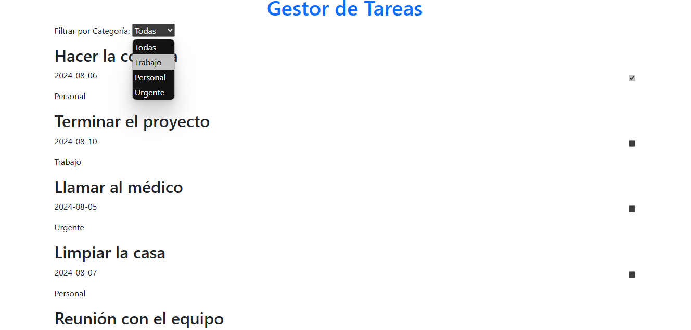
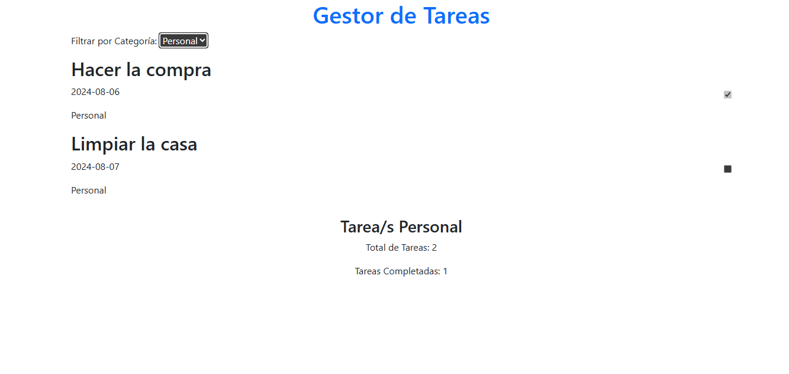

## Descripción del Ejercicio: Lista de Tareas

Esta aplicación de lista de tareas permite gestionar tareas con funcionalidades básicas:

- **Visualización de Tareas:** Muestra una lista con el título, categoría, fecha y estado de completado de cada tarea.
- **Filtrado por Categoría:** Permite filtrar las tareas por categoría (personal, trabajo, urgente).
- **Actualización del Estado:** Marca tareas como completadas y actualiza el conteo de tareas totales y completadas.

**Funcionalidades Clave:**
- Renderiza tareas y actualiza dinámicamente la lista según la categoría seleccionada.
- Calcula y muestra estadísticas de tareas en tiempo real.

El proyecto se basa en una estructura estática de tareas, demostrando la manipulación del DOM y el manejo de eventos en JavaScript.

        
